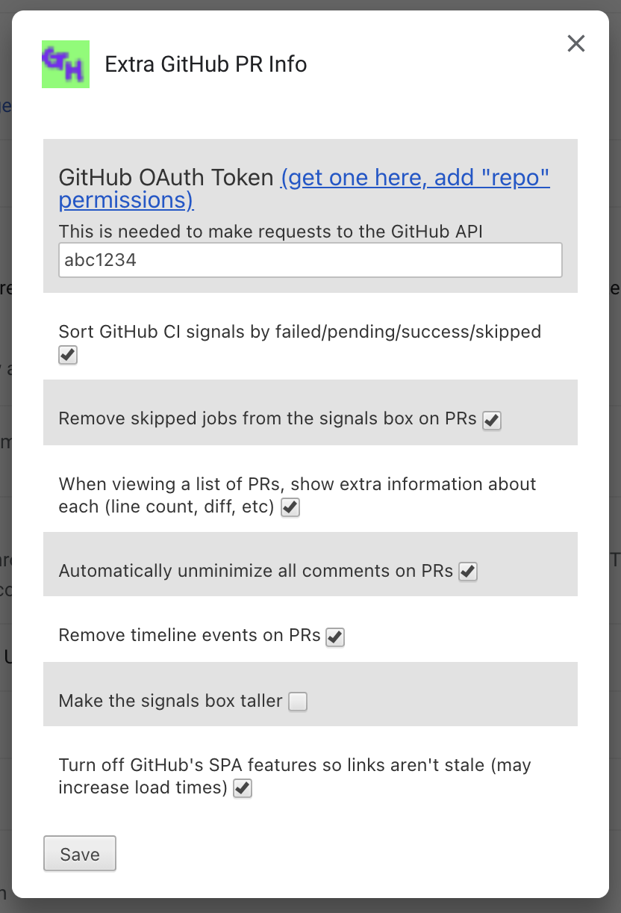
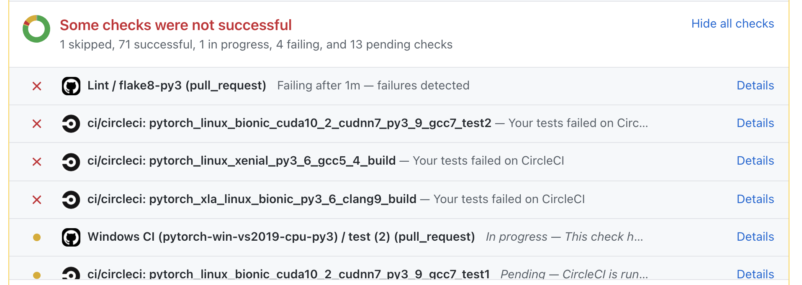
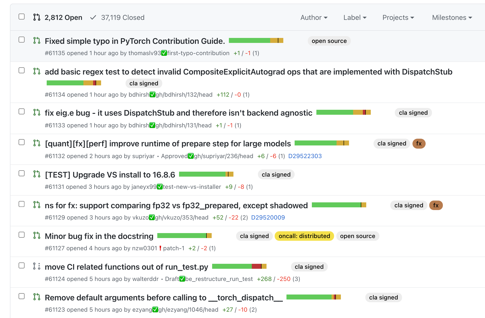

# [Extra GitHub PR Info](https://chrome.google.com/webstore/detail/extra-github-pr-info/pianlbphbcjkcghlboepagpoilanigff?hl=en-US)

This Chrome extension comes with a grab bag of features to make development on GitHub more pleasant. They are all off by default, so you will need to visit the extension's options page at [chrome://extensions/](chrome://extensions/) after installing to enable the ones you want.



Install it from the Chrome web store [https://chrome.google.com/webstore/detail/extra-github-pr-info/pianlbphbcjkcghlboepagpoilanigff?hl=en-US](https://chrome.google.com/webstore/detail/extra-github-pr-info/pianlbphbcjkcghlboepagpoilanigff?hl=en-US)

## Features

### Sort signals

Re-order the signals on GitHub to bucket in this order (with alphabetic ordering in each bucket): failed, pending, success, unknown, skipped.



### PR statuses

Show some extra information when viewing a list of PRs. This can be helpful to get more information at a glance (this feature requires a GitHub OAuth token be set in the settings since it uses the GitHub API). This includes: full build status (the bar), branch name, lines changed, and mergability status.



### Unminimize comments

Automatically un-minimize all comments on a PR.

### Remove bot comment counts

Remove bot comments from the count on PR lists.

### Disable pjax

GitHub uses [pjax](https://github.com/defunkt/jquery-pjax#:~:text=pjax%20is%20a%20jQuery%20plugin,page%20with%20the%20loaded%20HTML.) to act as a single-page application to improve load times. However, this can lead to stale data, notably when you go to the "files" tab on a PR sometimes the page loads with the "refresh" button already present since the diff it's showing you is out of date. Turning off pjax turns links back into regular links, so visitng a page invokes a fresh page load which avoids this issue.

## Installation

To use from source, clone this repo and visit [chrome://extensions/](chrome://extensions/) and load the folder as an unpacked extension.

```bash
git clone https://github.com/driazati/github-extension
```

To deploy a new version, use the Makefile and upload it in the extension dashboard.

```bash
make zip
```
